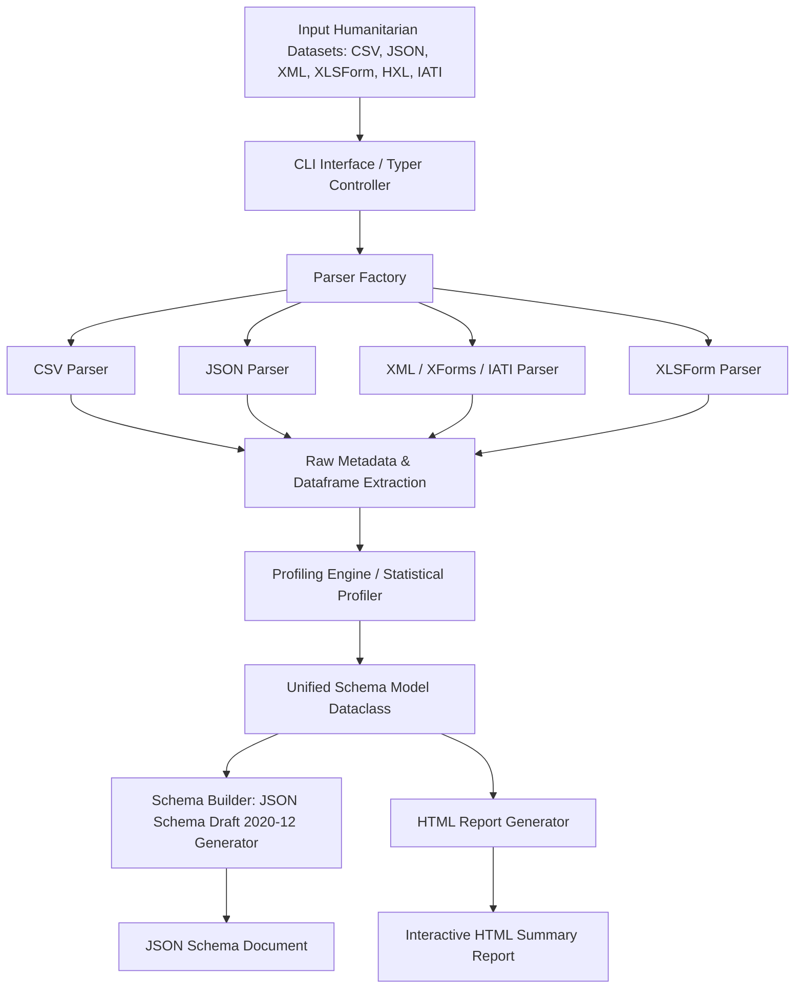
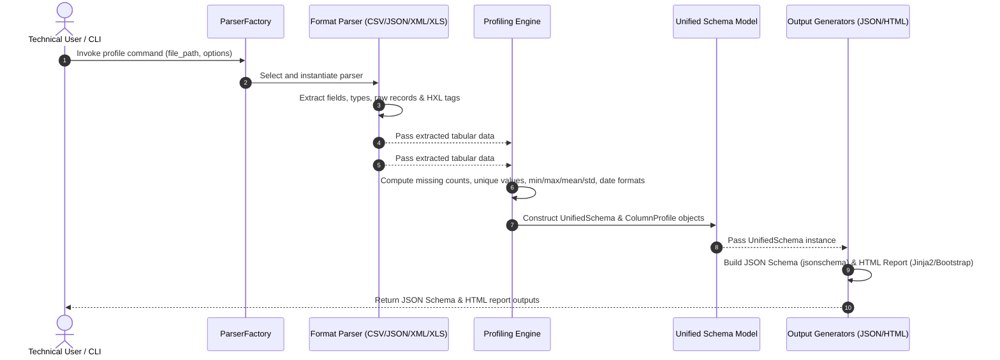

# System Architecture & Diagram Assets

This directory contains system architecture diagrams, data flow diagrams (DFD), and component interaction diagrams for the **Humanitarian Data Schema Analyser**.

## System Architecture Diagram


## Data Flow Diagram (DFD)


## Component Diagram
```mermaid
graph LR
    subgraph CLI Component
        CLI[cli/main.py]
    end
    subgraph Parser Component
        Factory[parsers/factory.py]
        Base[parsers/base_parser.py]
        CSV[parsers/csv_parser.py]
        JSON[parsers/json_parser.py]
        XML[parsers/xml_parser.py]
        XLS[parsers/xls_parser.py]
    end
    subgraph Profiling Component
        Prof[profiling/profiler.py]
    end
    subgraph Schema Representation
        Model[schema/unified_model.py]
        Builder[schema/schema_builder.py]
    end
    subgraph Report Component
        HTML[reports/html_report.py]
    end

    CLI --> Factory
    Factory --> Base
    Base <|-- CSV
    Base <|-- JSON
    Base <|-- XML
    Base <|-- XLS
    CLI --> Prof
    Prof --> Model
    CLI --> Builder
    Builder --> Model
    CLI --> HTML
    HTML --> Model
```
